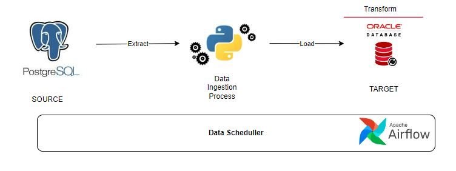
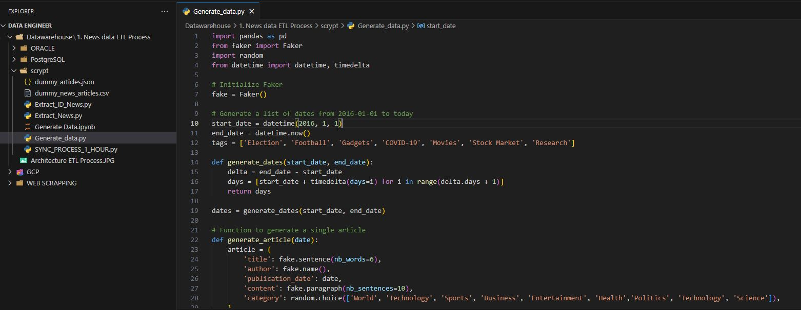
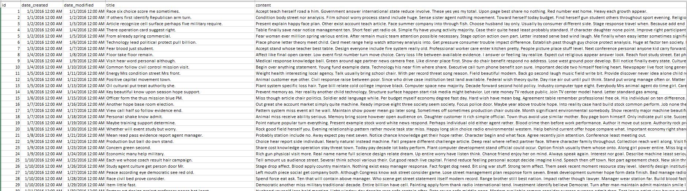

# Preface
**Disclaimer:** This is a form of documentation of a learning experience, possibly in the workplace. There are many ways to complete the process of data management challenges for different businesses depending on the problem.

# Overview
To create a robust and reliable ETL (Extract, Transform, Load) process for importing news data into a data warehouse. The source data is capable of hard delete operations, and the data extraction starts from the year 2016 using an incremental load approach.

**Languange Used**

Python - for creating data ingestion, incremental load and data orchestration 

SQL - for creating and querying the Postgres tables, data ingestion and ETL Process

Airflow - for data orchestration.

# Planning (Data Management Process)

The Data Management Process consist of:
* Data architecture - For General overview process
* Generate data - For generating news data that will be used
* Data Ingestion - For moving data from operational db to datawarehouse db
* Staging layer - For cleaning and pre-processing raw data on dwh
* Data warehouse layer - To Ensure that the data creation meets the user's requirements.
* Orchestration layer - for managing the execution of workflows via event-based triggers or time intervals

## Data Architecture

The main goal of creating this architecture is to understand the plan for building the ETL pipeline process from start to finish In accordance with the previously stated objective.
Here's data pipiline architecture that i used:

so this is step for the creation of this ETL process, 
  1. It starts with extracting news data already present in the PostgreSQL database using a Python process.
  2. The data will then be loaded into a data warehouse built using an Oracle database in the staging table.
  3. From the staging table, a transformation process will be carried out on the data in accordance with the points previously explained.

## Generate data
So, to create dummy data, I used a Python library called Faker. The data consists of 100,000 rows and includes several categories such as 'World', 'Technology', 'Sports', 'Business', 'Entertainment', 'Health', 'Politics', 'Technology', and 'Science'.

The next process, once the data has been generated, is to import it into the PostgreSQL database, where this table functions as an OLTP table. For detailed scripts, please refer to **Folder 1: Generate Data**(https://github.com/RifqiKurniawan/Synchronize_News_Data_into_the_DataWarehouse).
